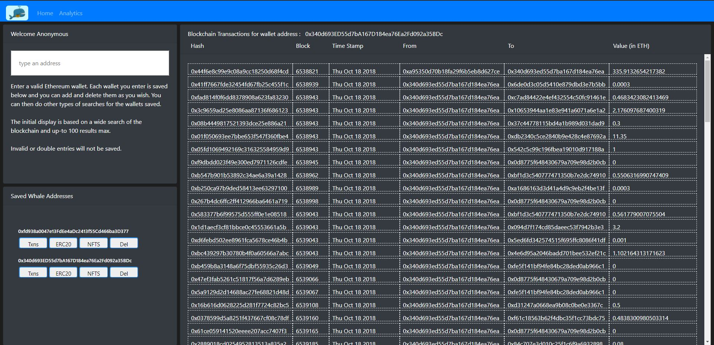
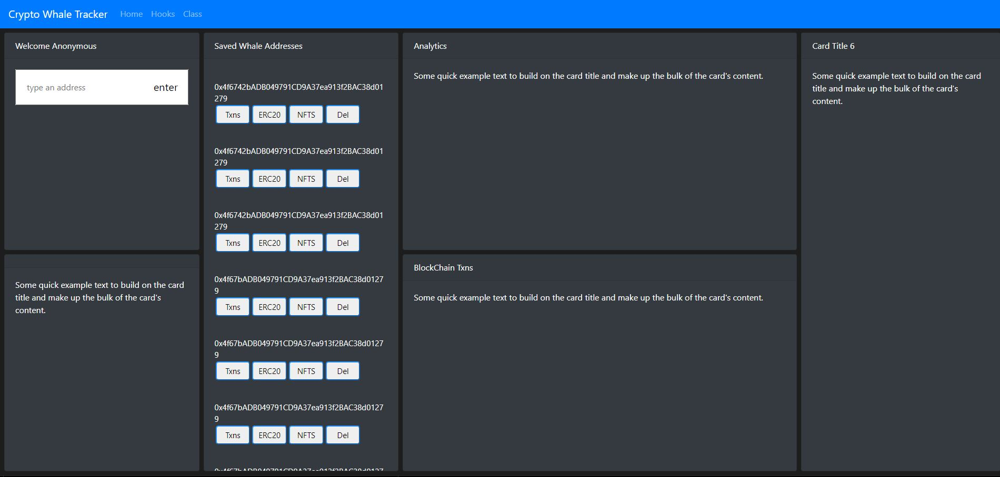
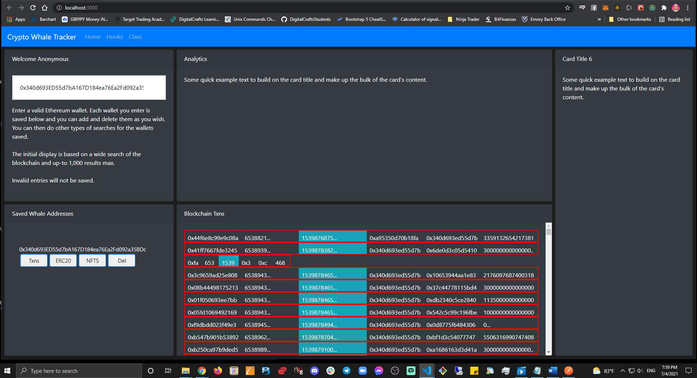

# Crypto Darkweb Flow Tracker

Crypto Darkweb Flow Tracker is a React dashboard for monitoring wallet activity across public blockchain data. It pulls transaction and balance data from Etherscan-compatible endpoints, surfaces wallet analytics, and highlights suspicious transfer patterns in a cleaner investigation-focused UI.

Live site:
https://rakhul07.github.io/Crypto-Darkweb-Flow-tracker/

## Features

- Wallet transaction lookup for tracked addresses
- Balance and activity views for supported networks
- ERC-20 transaction inspection
- Market analytics dashboard
- Suspicious flow heuristics for high-risk transaction patterns
- Local wallet tracking with Redux state persistence

## Tech Stack

- React
- Redux
- React Router
- Bootstrap and custom CSS
- Etherscan API
- CoinGecko market data API
- Express for local auth/API experiments

## GitHub Pages Notes

GitHub Pages only serves the static frontend. The React app is configured for GitHub Pages routing, and the repository includes a GitHub Actions workflow to deploy the `build` output automatically from `main`.

The local Express server in `server.js` is not hosted by GitHub Pages. If you want signup/login endpoints live, they need a separate backend host.

To make GitHub Pages builds use your Etherscan key, add this repository secret in GitHub:

- `REACT_APP_API_KEY`

## Local Development

1. Install dependencies:

```powershell
npm.cmd install
```

2. Create a local `.env` from `.env.example` and add your Etherscan API key.

3. Start the React app:

```powershell
npm.cmd start
```

4. Optional: run the local Express server separately:

```powershell
node server.js
```

## Screenshots






## Resources

- https://etherscan.io/apis
- https://web3js.readthedocs.io/en/v1.3.4/
- https://javascript.info/async
- https://reactjs.org/
- https://docs.soliditylang.org/en/v0.5.7/
- https://eips.ethereum.org/EIPS/eip-20
- https://github.com/ethereum/EIPs/blob/master/EIPS/eip-20.md
